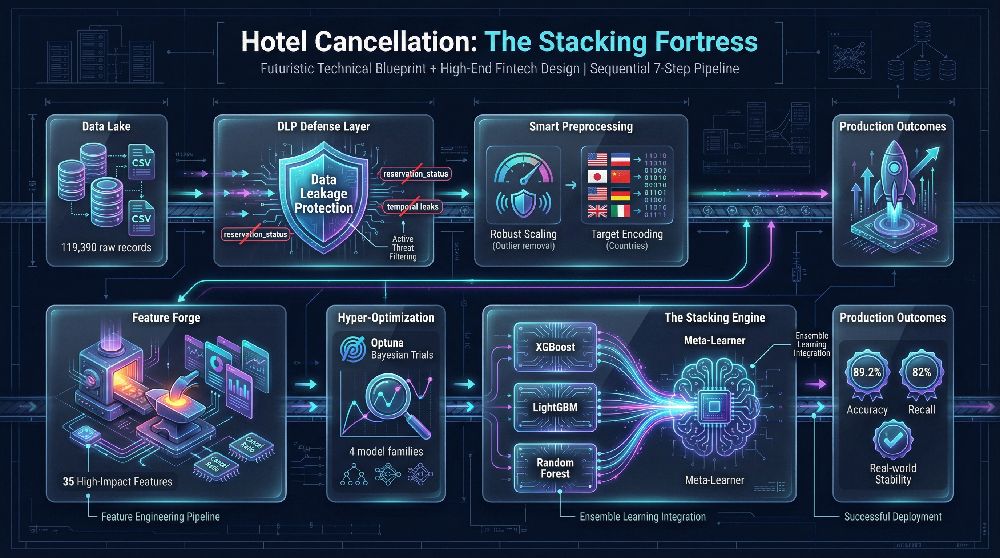

# 🏨 Hotel Booking Cancellation Prediction System



> **🚀 Biznes Qiymati:** Ushbu loyiha 119,000 dan ortiq ma'lumotlarni qayta ishlab, mehmonxona bronlarini bekor qilinishini **89.2% aniqlikda** bashorat qiluvchi sun'iy intellekt konveyeridir.

---

## 🛡️ 1. Data Leakage Protection (DLP) — Loyihaning "Yuragi"
Biz modelning haqqoniyligini ta'minlash uchun DLP tizimini eng yuqori darajada qo'lladik:
* **Target Leakage bloklangan:** `reservation_status` va `reservation_status_date` kabi kelajakdan "xabar beruvchi" ustunlar butkul o'chirildi.
* **Temporal Leakage bloklangan:** Model faqat ma'lum bir yilga (`arrival_date_year`) moslashib qolmasligi uchun bu ustun olib tashlandi.
* **Fit-Transform Logic:** Barcha scaling va encoding amallari faqat `X_train` asosida o'rganildi, bu esa test ma'lumotlari modelga "sizib" kirmasligini kafolatlaydi.

---

## 🧪 2. Advanced Preprocessing (A-Z bosqichlar)
* **Robust Scaling:** Outlierlar (keskin farqli narxlar) modelni buzmasligi uchun `RobustScaler` tanlandi.
* **KNN Imputation:** Bo'sh qolgan ma'lumotlar qo'shni mijozlar xulq-atvori asosida aqlli to'ldirildi.
* **Target Encoding:** 150 dan ortiq davlatlar (`country`) modelga tushunarli va samarali formatda kodlandi.

---

## 🧠 3. Murakkab Feature Engineering (FE_)
Yangi yaratilgan ustunlar biznes-mantiqqa asoslangan:
* **`FE_total_people`:** Jami mehmonlar soni.
* **`FE_cancel_ratio`:** Mijozning o'tmishdagi bekor qilish tajribasi (eng kuchli faktor).
* **Feature Selection:** 100+ ustundan faqat eng muhim **35 tasi** `SelectKBest` orqali saralandi.

---

## 🚀 4. "Monster" Stacking Ensemble
Bitta model o'rniga biz 4 xil algoritmni birlashtirdik:
* **Base Learners:** `XGBoost`, `LightGBM`, `Random Forest`.
* **Meta-Learner:** `Logistic Regression` (barcha modellarning xulosasini birlashtiruvchi "miya").
* **Optuna:** Har bir model uchun eng yaxshi parametrlar 30 ta trial orqali qidirib topildi.

---

## 🔬 Tadqiqot va Isbotlar (Reports)
Loyiha natijalari quyidagi hisobotlarda batafsil bayon etilgan. **Ko'rish uchun ustiga bosing:**

1. [📈 Modellar Solishtiruvi va Metrikalar](./docs/1_metrics_report.md)
2. [🔍 Feature Importance va Mijozlar Tahlili](./docs/2_feature_importance.md)
3. [🧪 Offline Testing (Unseen Data Test)](./docs/3_unseen_data_test.md)

---

## 🚀 Modelni Ishga Tushirish
```bash
python -m src.predict