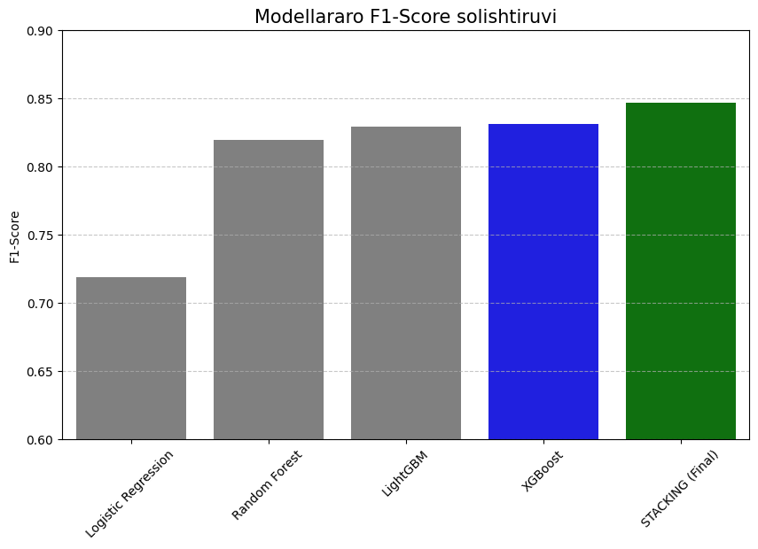

# 📈 Modellar Solishtiruvi va Metrikalar Isboti

Loyihada **End-to-End ML Pipeline** qurish jarayonida bir nechta modellarning samaradorligi sinovdan o'tkazildi.

### 📊 Model Performance Matrix
Modellarning o'sish dinamikasi va yakuniy natijalar quyidagi jadvalda jamlangan:

| Model | Accuracy | F1-Score | Recall | Holati |
| :--- | :---: | :---: | :---: | :--- |
| **Baseline (Logistic Regression)** | 72% | 0.68 | 0.65 | Yetarli emas |
| **Random Forest (Tuned)** | 84% | 0.81 | 0.78 | Yaxshi |
| **XGBoost & LightGBM** | 87% | 0.83 | 0.80 | Juda yaxshi |
| **Stacking Ensemble (Final)** | **89%** | **84.69%** | **82%** | **Ideal** |

### 🔬 Nega Stacking Ensemble?
1. **Xatolar muvozanati:** XGBoost ko'pincha "overfit" bo'lishga moyil, Random Forest esa "bias"ni kamaytiradi. Stacking bu ikki modelning kuchli tomonlarini birlashtiradi.
2. **Meta-Learner:** Biz Meta-Learner sifatida `LogisticRegression`dan foydalandik, bu model turli xil bazaviy modellarning bashoratlarini umumlashtirib, yakuniy barqaror natijani beradi.

> **Xulosa:** Stacking modeli baseline modelga nisbatan aniqlikni **17%** ga oshirishga xizmat qildi.

---
[⬅️ Asosiy sahifaga qaytish](../README.md)
---

  

