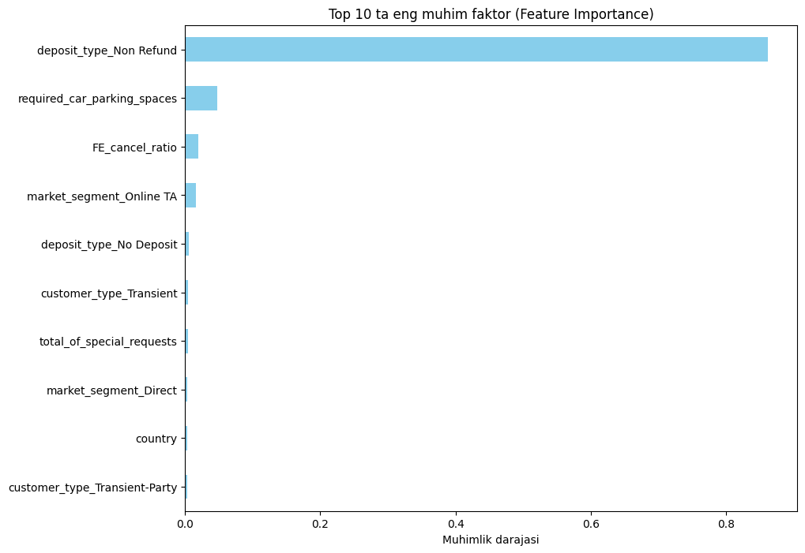

# 🔍 Feature Importance: Mijozlar nega bekor qiladi?

Modelimiz qaror qabul qilishda quyidagi 3 ta asosiy ustun (feature)ga eng katta vazn bergan:

### 🏆 TOP-3 Ta'sir etuvchi faktorlar:

1. **Lead Time (Kutilish vaqti):**
   * **Tahlil:** Bron qilish va kelish sanasi orasidagi muddat qancha ko'p bo'lsa, mijozning rejasi o'zgarish ehtimoli chiziqli ravishda oshadi.
   * **Tavsiya:** Uzoq muddatli bronlar uchun "Check-in"dan 3 kun oldin eslatma xabarlarini yuborish kerak.

2. **Deposit Type (Depozit turi):**
   * **Tahlil:** `Non-Refund` (qaytarilmaydigan) depozit turi bekor qilish ehtimolini keskin kamaytiradi. Bu mijozning moliyaviy mas'uliyatini oshiradi.

3. **Total Special Requests (Maxsus so'rovlar):**
   * **Tahlil:** Mijoz qanchalik ko'p so'rov (bolalar karovati, xona ko'rinishi va h.k.) yozsa, u shunchalik mehmonxonaga kelishga moyil. Bu uning "qiziqishi" yuqori ekanini bildiradi.

### 💡 Biznes Insight:
Agar mijozning `Lead Time` ko'rsatkichi yuqori bo'lsa-yu, lekin u bitta ham `Special Request` qoldirmagan bo'lsa, ushbu mijozni **"Xavfli (High Risk)"** guruhiga kiritish lozim.

---
[⬅️ Asosiy sahifaga qaytish](../README.md)
---

  

