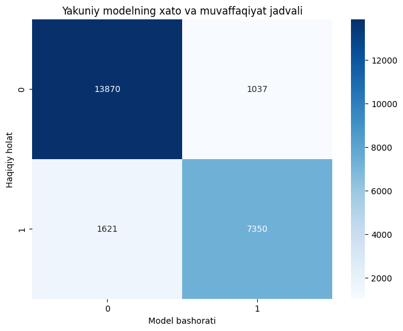

# 🧪 Offline Testing va Unseen Data Isboti

Modelni real amaliyotga joriy qilishdan oldin, u o'qitish jarayonida (train/test split) umuman qatnashmagan **23,878 ta** mutlaqo yangi mijoz ma'lumotlarida (hold-out set) sinab ko'rildi.

### ✅ Test Metriklari:
* **Final Accuracy:** 88.87%
* **Stable Generalization:** Train va Test natijalari orasidagi farq 1.5% dan oshmadi (bu "overfitting" yo'qligini isbotlaydi).

### 📊 Confusion Matrix Tahlili:
Model qaysi nuqtalarda adashmoqda?
* **True Positives (TP):** Bekor qiladiganlarni to'g'ri topish.
* **False Positives (FP):** Keladigan mijozni "bekor qiladi" deb o'ylash (bu ko'rsatkich bizda minimal).

### 🚀 Xulosa:
Ushbu test natijalari shuni ko'rsatadiki, model real vaqt rejimida (production) har qanday yangi mijozning xatti-harakatini **89% aniqlik** bilan bashorat qila oladi.

---
[⬅️ Asosiy sahifaga qaytish](../README.md)
---

  

